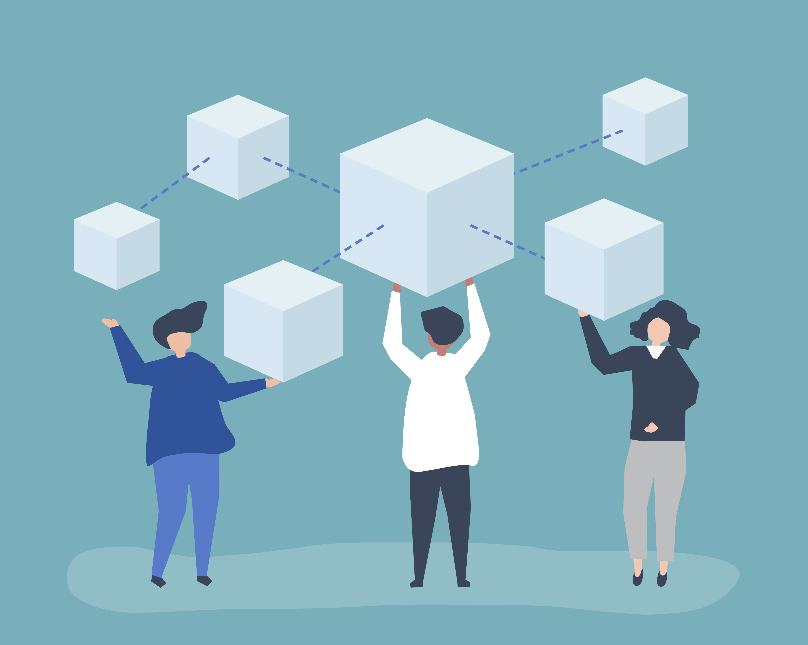
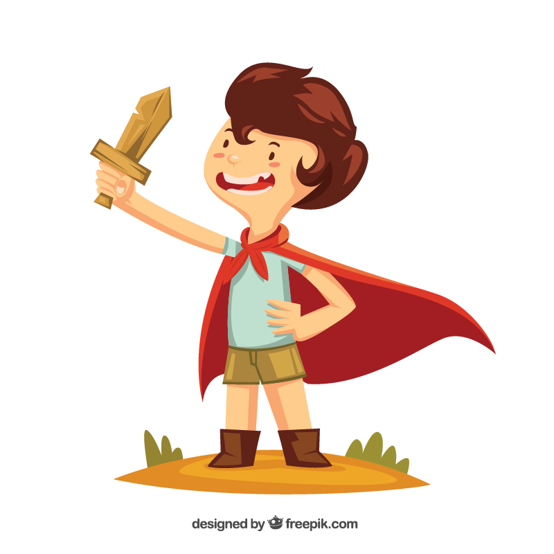

Hva er egentlig en blokkjede, blokkjedeteknologi eller blockchain som det heter på engelsk. Kjært barn har gjerne mange vanskelige navn, dette barnet er intet unntak. Vi tar en nærmere titt på hva det virkelig betyr.

##Magiske internettpenger
Selv om blokkjedeteknologi ofte kobles sammen med fenomenet og internettvalutaen Bitcoin, betyr det ikke at konseptet er helt nytt. Det betyr heller ikke at magiske internettpenger er det eneste bruksområdet for en blokkjede. La oss begynne med å forklare en blokkjede, på en måte som alle kan relatere seg til.

##Kom bli med - inn å se
Ettersom alt dette høres litt magisk ut, la oss ta for oss et magisk eksempel når vi skal forklare det hele.

Vi drar langt tilbake i tid, til et mektig kongerike. Her finner vi en liten landsby, med mange små magiske landsbyboere. Blant alle disse landsbyboerne finner vi Bjørn.  
Denne gledesdagen er Bjørn sin bursdag, og heldig som han er har han fått et tresverd fra sine foreldre i bursdagsgave. Sverdet svinger Bjørn ivrig rundt seg, mens han ler lystig.

Som de fleste ting i verden har ikke sverdet til Bjørn alltid vært et sverd. Det har heller ikke alltid tilhørt Bjørn. Heldigvis finnes det en måte i denne magiske landsbyen å se hvor sverdet begynte sin reise, og hvem det har tilhørt, helt frem til Bjørn fikk det i bursdagsgave.

##En magisk bok
Landsbyboerne hadde nemlig en magisk bok i midten av landsbyen. Denne  boken inneholdt informasjon om alle tingene som ble byttet mellom landsbyboerne, ikke nok med det, den inneholdt også informasjon om alle tingene som kom inn, og ble sendt ut til andre landsbyer i kongeriket. Alle hadde tilgang til denne boken, og alle kunne fritt oppdatere boken hver gang de gjorde en handel.

Så når foreldrene til Bjørn byttet til seg sverdet for en bøtte med poteter, oppdaterte både selgeren og foreldrene til Bjørn den magiske boken med informasjon om deres handel. Men historikken til sverdet går mye lenger tilbake enn det.

Du skjønner, før sverdet ble til et sverd så var det nemlig en treplanke, og før det var en treplanke så var det en tømmerstokk, og før det var en tømmerstokk så var det jammen meg et stort tre som vokste i skogen rett sør for landsbyen.

Alle landsbyboerne inkludert Bjørn kunne finne ut av dette ved å se i den magiske boken. Her kunne man se  vei fra tre til sverd, og alle stopp det tok underveis. Det samme gjaldt faktisk for alle andre ting i landsbyen.

For et fantastisk verktøy dette var! Det betyr at ingen bortsett fra landsbyboerne i felleskap holdt styr på all denne informasjonen. Det var ingen mellommenn som krevde penger for å kunne lese og skrive i boken, og ingen kunne skrive feil informasjon i boken uten at alle i landsbyen var enige om det.

Samfunnet brukte også boken til å holde seg informert om handelesvirksomheten til alle andre landsbyer i kongeriket. Alle landsbyene delte nemlig innholdet i sin egen bok til en mye større bok. Denne boken inneholdt informasjon om alle varer og handler i hele kongeriket.

Bjørn lekte glad og fornøyd med sverdet sitt, uten å bry seg særlig om hvor det kom fra. Men om han en dag ville vite det, kunne han bare gå å se i den magiske boken.

##Oppsummering
Denne historien er egentlig ment som en enkel forklaring til barn, for å forstå hva en blokkjede er, og hvordan blokkjedeteknologi fungerer. Konseptene fra historien kan kort oppsummeres slik:

* En blokk i blokkjeden vedlikeholdes av alle brukerne i felleskap
* Alt er desentralisert, noe som betyr at alle som ønsker kan få en komplett kopi av hele blokkjeden
* Alle transaksjoner kan spores, og all historikk er synlig for alle

Magien er i dag byttet ut med digitale tjenester, som fungerer takket være et felles og sammenkoblet internett. Blokkjeden er grunnlaget for mange nye spenende tjenester, men felles for alt som bygges rundt blokkjedeteknologi er ønsket om frihet, åpenhet og desentralisering.

Les gjerne flere av våre innlegg for å forstå mer av kryptoverdenen.

>Bildene er laget av [Freepik](https://www.freepik.com), og historien er hentet fra Ari Zoldan hos [Inc.com](https://www.inc.com/ari-zoldan/how-i-explained-blockchain-to-my-6-year-old-son.html).
